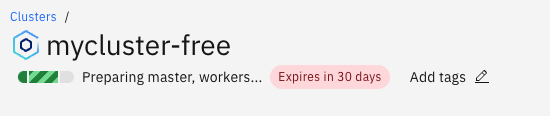
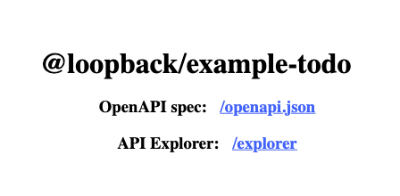

# Deploy LoopBack application to IBM Cloud using Kubernetes 

Assuming you have a LoopBack application already running locally, the next step you want to do is to deploy somewhere on the cloud so that others to use it. That's the right tutorial for you! I'm going to show you from start to finish on how to deploy a LoopBack application to IBM Cloud using IBM Cloud Kubernetes service. 

If you don't and just happen to find this tutorial, don't worry, I got you covered as well. 

_Note: this tutorial is a bit different than the one in the [LoopBack documentation](https://loopback.io/doc/en/lb4/deploying_to_ibm_cloud_kubernetes.html) in a way that my tutorial here will be using a declarative approach for deployment._ 

## Before we begin

Before we begin, let's make sure you have everything set up.

- [1. Get the LoopBack application ready](#1-get-the-loopback-application-ready)
- [2. Install IBM Cloud CLI and plugin](#2-install-ibm-cloud-cli-and-plugin)

### 1. Get the LoopBack application ready

In this tutorial, I'm going to use this [todo app](https://github.com/loopbackio/loopback-next/tree/master/examples/todo) as illustration. If you have your own app, feel free to proceed with yours. 

If not, follow [this todo tutorial](https://loopback.io/doc/en/lb4/todo-tutorial.html) on the LoopBack documentation to either just download the app or follow along the steps to build one. 

### Things to review 
Make sure you have `Dockerfile` and `.dockerignore` file in the app. By default, it should be generated for you using the LB4 CLI. Sample files can be found [here](https://github.com/loopbackio/loopback-next/tree/master/examples/todo).

## 2. Install IBM Cloud CLI and plugins

Skip this step if you already have the IBM Cloud CLI and the container service plugin installed.

### Install IBM Cloud CLI

Follow the [install standalone IBM Cloud CLI instructions](https://cloud.ibm.com/docs/cli?topic=cli-install-ibmcloud-cli).

To test, run:
```sh
$ ibmcloud login
```

If you're using SSO enabled, you can login using:
```sh
$ ibmcloud login --sso
```

### Install the container service plugin

The container service plugin is being used for the `ibmcloud ks` command.

To install, run the following commands:
```sh
$ ibmcloud plugin install container-service
```

You'd also need `kubectl` CLI as well. Follow this [install kubectl](https://kubernetes.io/docs/tasks/tools/) documentation. 


Now that you have everything set up. Let's get started! 

---- 

## Step 1: Create Kubernetes cluster on IBM Cloud

1. Go to [IBM Cloud web site](https://cloud.ibm.com) > `Catalog`. Or go directly to https://cloud.ibm.com/catalog

2. From the IBM Cloud catalog, search for `Kubernetes`. 

3. For plan details, choose `Free`. 

    Feel free to pick the other plans, but for the purpose of this tutorial, we'll pick the free plan. Note that there's only one worker node and the cluster will be deleted after 30 days for the free plan.

4. Keep everything else as default. The resource details are:
    ```
    cluster name: mycluster-free
    resource group: default
    ```

5. Click Create.

After this, you'll see something like below, indicating that the cluster is being created. It will take a few minutes. 



To learn more about IBM Cloud Kubernetes Service, go to: https://cloud.ibm.com/docs/containers?topic=containers-getting-started. 


## Step 2: Build and push the docker image

Next, we are going to build the Docker image using the Dockerfile that comes with the LoopBack application. The Docker image will be used when we're creating the deployment object in the next step.

Run the commands similar to what's listed below. Instead of using my docker hub id, replace it with your own.

```sh
$ docker login
$ docker build -t dhmlau/loopback-todo:1.1 .
$ docker push dhmlau/loopback-todo:1.1
```

If you log into [Docker hub](https://hub.docker.com/) web site, you should be able to see your image there. Or simply run `docker pull dhmlau/loopback-todo:1.1`.  


## Step 3: Define and apply the deployment file

### Create the deployment manifest file
We're going to use the declarative approach here, meaning we'll define the resources within a manifest file (a yaml file) and apply it to the cluster. 

Our yaml file for deployment looks like:

```yaml
apiVersion: apps/v1
kind: Deployment
metadata:
  name: todo-app-deployment
spec:
  replicas: 1
  selector:
    matchLabels:
      component: todo
  template:
    metadata:
      labels:
        component: todo
    spec:
      containers:
        - name: todo
          image: dhmlau/loopback-todo:1.1
          ports:
            - containerPort: 3000
```

A few things to note:
- the deployment app name is `todo-app-deployment`
- we are getting the image of the app from the Docker image we pushed in the previous step
- we'll be using port 3000 for the app

You can also find the file in [deployment.yaml](./deployment.yaml).

### Apply the manifest file

At this point, you've logged into IBM Cloud using the `ibmcloud login` command. 

1. In order to access your cluster, run the command below:

    ```sh
    $ ibmcloud ks cluster config --cluster mycluster-free
    ```
    where `mycluster-free` is my cluster name. 

    _Forgot what you've created? Don't worry. You can run `ibmcloud ks cluster ls` to find it._

2. Apply the manifest file we just created

    ```sh
    $ kubectl apply -f deployment.yaml
    deployment.apps/todo-app-deployment created
    ```

    _Side note:_
    - If you want to delete the deployment for whatever reason later, you can always run the delete command:
    ```sh
    $ kubectl delete -f deployment.yaml
    ```
    - If you've modified the deployment.yaml and want to rerun it again, you don't need to run the delete command. Just rerun the `apply` command again.


## Step 4: Create the service

Now, we're going to create the `todo-app-service` that connect to the deployment we just created in the previous step. Create a file called `todo-app-service.yaml` with the following content. 

```yaml
apiVersion: v1
kind: Service
metadata:
  name: todo-app-service
spec:
  type: NodePort
  selector:
    component: todo
  ports:
    - port: 3000
      targetPort: 3000
```


Run this command to create the service.
```sh
$ kubectl apply -f todo-app-service.yaml
service/todo-app-service created
```

## Step 5: Access the Todo App on IBM Cloud

By running the command below, you can see the details of the service that's just created. The port number shown for `NodePort` is the port number where the LoopBack Todo app will be available. 

```sh
$ kubectl describe service todo-app-service
Name:                     todo-app-service
Namespace:                default
Labels:                   <none>
Annotations:              <none>
Selector:                 component=todo
Type:                     NodePort
IP Family Policy:         SingleStack
IP Families:              IPv4
IP:                       172.21.81.203
IPs:                      172.21.81.203
Port:                     <unset>  3000/TCP
TargetPort:               3000/TCP
NodePort:                 <unset>  30482/TCP
Endpoints:                
Session Affinity:         None
External Traffic Policy:  Cluster
Events:                   <none>
```

Run the following to the public IP:
```
$ ibmcloud ks worker ls --cluster mycluster-free
OK
ID        Public IP        Private IP       Flavor   State    Status   Zone    Version
kube-xx   169.51.xxx.xxx   10.144.xxx.xxx   free     normal   Ready    mil01   1.24.9_1550
```

_Note: `mycluster-free` is my cluster name. Change it if you're using a different name._


## Step 6: View the REST APIs from LoopBack explorer

With the public IP address and the port number from NodePort, open the browser and go to:
`http://<public IP>:<port number>`. You should be able to see something like below:




# References 
- Deploy a microservices app on IBM Cloud by using Kubernetes, https://www.ibm.com/cloud/architecture/tutorials/microservices-app-on-kubernetes
- Kubernetes documentation, https://kubernetes.io/docs/concepts/services-networking/service/
- IBM Cloud Kubernetes service, https://cloud.ibm.com/docs/containers?topic=containers-getting-started
